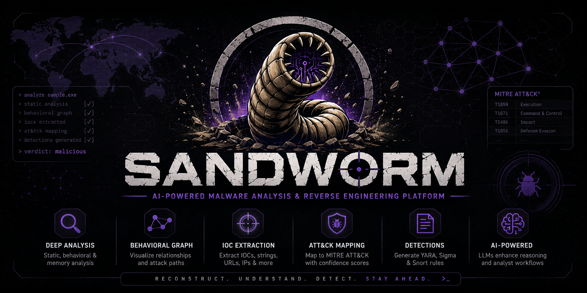
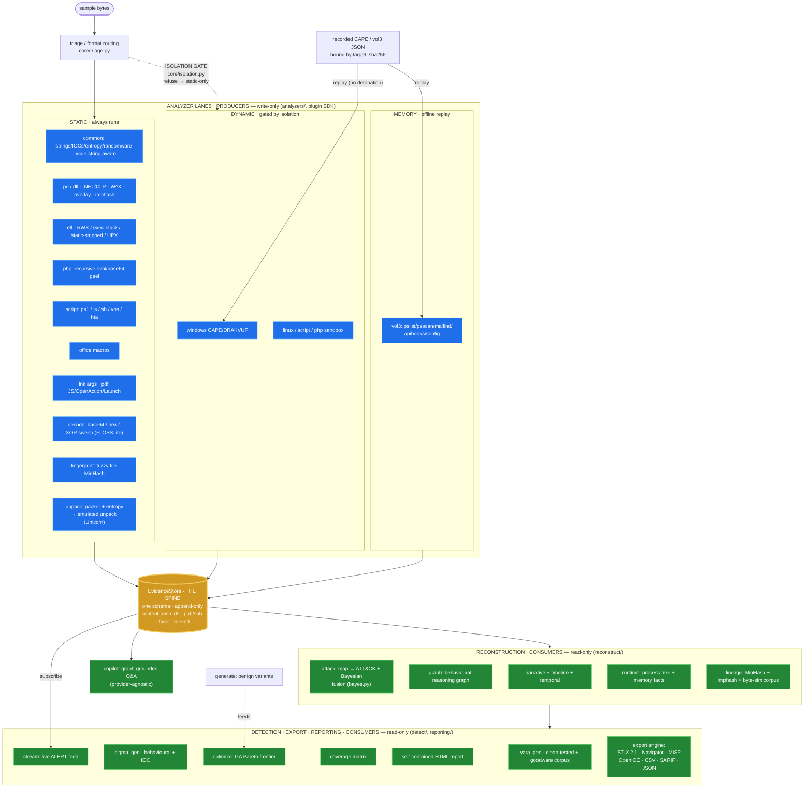

<div align="center">



<br/>


### Given a sample, reconstruct what happened, explain why, and emit detections.

</div>

SANDWORM is an isolated, multi-format malware reverse-engineering platform. It is
*not* "another sandbox": every subsystem exists to serve one promise — take a
sample, reconstruct its lifecycle from **static, dynamic, and memory** evidence,
and produce explainable attack narratives, behavioral graphs, and defender-ready
detections (YARA + Sigma).

It handles **PE/DLL (incl. .NET), ELF (C/Rust/Go), PHP webshells, scripts
(PowerShell/JS/shell/VBScript/HTA), Office macros, and the phishing initial-access
formats LNK & PDF** through a pluggable analyzer architecture — new formats are
plugins, not core changes. (JAR/APK/Mach-O are recognised and named.)

Every conclusion is **traceable to evidence**, labeled **observed vs inferred**,
scored by a **Bayesian confidence model**, explained through a **reasoning chain**,
and turned into **actionable detections** (YARA + Sigma) and **defender-ready
exports** (STIX 2.1, MISP, OpenIOC, ATT&CK Navigator, SARIF, CSV) — which makes
SANDWORM an explainable malware-reasoning platform rather than a collection of parsers.

```bash
pip install -e ".[dev]"

# Static analysis: recursively-deobfuscated payload (incl. base64/hex/XOR sweep),
# behavioral graph, ATT&CK mappings (each with a Bayesian confidence and a "why"),
# clean-tested YARA + Sigma.
sandworm analyze samples/synthetic/benign_webshell.php

# Dynamic + memory lanes via offline replay of recorded reports — bound by sha256
# to the sample they were captured from, so they cannot be misattributed:
sandworm analyze samples/synthetic/loader_demo.exe \
  --cape-report   samples/synthetic/recorded_cape_report.json \
  --memory-report samples/synthetic/recorded_vol3_report.json
#   → temporal timeline, memory forensics (hidden procs / API hooks / carved config),
#     and ATT&CK techniques upgraded inferred → observed.

sandworm analyze sample --stream      # live evidence feed, ALERT on high-signal findings
sandworm ask "what execution sinks were found?"   # graph-grounded copilot

# Defender-tooling exports (all pure consumers of the evidence store):
sandworm analyze sample --stix out.json --misp misp.json --openioc ioc.xml \
                        --navigator layer.json --csv iocs.csv --json findings.json

# Batch a directory into one machine report and gate a pipeline on verdict:
sandworm batch ./quarantine --format sarif --out results.sarif --fail-on High
```

**Optional accelerators & hardening** (all degrade gracefully when absent):

```bash
pip install -e ".[perf]"     # numpy — ~20x entropy on multi-MB samples
pip install -e ".[secure]"   # pyzipper — AES-256 sample encryption at rest
pip install -e ".[emulate]"  # unicorn + capstone — emulate packer stubs to recover unpacked code
pip install -e ".[static]"   # lief/pefile/pyelftools/capstone/oletools/capa
```

---

## Table of contents

- [The architectural spine: an Evidence Layer](#the-architectural-spine-an-evidence-layer)
- [Architecture diagram](#architecture-diagram)
- [How a sample flows through the pipeline](#how-a-sample-flows-through-the-pipeline)
- [The three evidence lanes](#the-three-evidence-lanes)
- [Reconstruction & the confidence model](#reconstruction--the-confidence-model)
- [Advanced capabilities](#advanced-capabilities)
- [Detections (YARA + Sigma + optimisation)](#detections-yara--sigma--optimisation)
- [Isolation & safe handling](#isolation--safe-handling-enforced-in-code-not-docs)
- [The plugin SDK](#the-plugin-sdk)
- [CLI reference](#cli-reference)
- [Tech stack](#tech-stack)
- [Status — deferred to v2](#status--whats-deferred-to-v2-honest-list)
- [Development](#development)

---

## The architectural spine: an Evidence Layer

Every engine emits **one** normalized schema — the `EvidenceItem` — instead of
talking to each other. Producers (analyzers) only *write* EvidenceItems; consumers
(behavioral graph, timeline, ATT&CK mapper, detection generators, copilot) only
*read* from the store. This decoupling is what makes SANDWORM extensible and
explainable, and it is why most advanced features are **consumers of existing
evidence, not new pipelines**.

```python
class EvidenceItem(BaseModel):
    run_id: str
    ts: str                       # ISO-8601 or monotonic offset
    source: str                   # static.pe | dynamic.windows.cape | memory.vol3 | …
    artifact: str                 # process | file | registry | network | api_call | string | …
    operation: str                # create | write | read | connect | inject | spawn | decode | exec
    subject: dict                 # who acted
    object: dict                  # what was acted on
    details: dict                 # format-specific, free-form
    confidence: float             # 0..1 — REQUIRED on every item
    evidence_refs: list[str]      # back-links to raw artifacts / parent layers
```

`confidence` is **required and validated on every item** — explainability depends
on it. A content-hash `id` collapses duplicate observations so the graph never
explodes. The store is append-only, thread-safe, and supports **pub/sub**
(`subscribe()`) for live streaming.

---

## Architecture diagram

**Colour legend** — the data flow is one-directional: 🔵 **producers** (analyzers) only *write* evidence · 🟠 the **EvidenceStore** spine holds the one schema · 🟢 **consumers** only *read* it. Nothing skips the store; every arrow into a consumer starts at the store.



<details>
<summary>ASCII fallback (same architecture · [P]=producer [S]=spine [C]=consumer)</summary>

```
                              ┌──────────────┐
   sample bytes ─────────────▶│   triage     │ → pe/elf/php/script/vbs/hta/lnk/pdf/office/generic
                              └──────┬───────┘
            ┌────────────────────────┼─────────────────────────────┐
            ▼                        ▼ (ISOLATION GATE)             ▼ (offline replay,
   ┌──────────────────────┐ ┌───────────────────┐          bound by target_sha256)
   │ [P] STATIC (always)  │ │ [P] DYNAMIC(gated)│          ┌───────────────────┐
   │ common pe elf php    │ │ CAPE/DRAKVUF      │◀───────  │ recorded CAPE JSON │
   │ script lnk pdf       │ │ linux/script/php  │          └───────────────────┘
   │ decode fingerprint   │ │ refuse→static-only│          ┌───────────────────┐
   │ office UNPACK+emulate│ └─────────┬─────────┘  MEMORY  │ recorded vol3 JSON │──▶ [P] vol3
   └──────────┬───────────┘           │            ◀────────└───────────────────┘
              └───────────┬───────────┴───────────────────────────┬─┘
                          ▼
            ╔═══════════════════════════════════════╗
            ║ [S] EvidenceStore — the one schema     ║  append-only · content-hash ids
            ╚═══════════════════╤═══════════════════╝  pub/sub · facet-indexed
        ┌───────────────────────┼──────────────────────────┬─────────────────────┐
        ▼                       ▼                          ▼                     ▼
  [C] RECONSTRUCT       [C] DETECT + REPORT          [C] EXPORT ENGINE     [C] COPILOT
  attack_map (+Bayes)   yara/sigma + optimize        STIX·Navigator·MISP   (graph-grounded)
  graph narrative       coverage matrix              OpenIOC·CSV·SARIF     [C] STREAM
  timeline temporal     self-contained HTML report   ·findings JSON        (subscribe→ALERT)
  runtime lineage
```
</details>

---

## How a sample flows through the pipeline

`core/pipeline.py :: analyze_sample()` orchestrates one run:

1. **Triage** (`core/triage.py`) — magic-byte + heuristic format detection
   (MZ+verified PE signature, ELF, Mach-O, LNK CLSID, `%PDF`, `<?php`, shebang,
   VBScript/HTA, OLE, OOXML/JAR/APK ZIP markers, …) selects which analyzer tags fire.
2. **Isolation gate** (`core/isolation.py`) — decides whether the dynamic lane may
   run *at all*. If isolation can't be verified, dynamic is **refused** and the run
   continues static-only.
3. **Static analyzers** run unconditionally; **dynamic** analyzers run only behind
   the gate.
4. **Recorded-report replay** (offline) — `--cape-report` / `--memory-report`
   ingest prior evidence; this executes nothing, so it runs without the gate. Each
   report must declare `target_sha256` matching the sample, or it is refused (a
   recorded run is only a file's behaviour if it was *captured from that file*).
5. **Reconstruction** — graph, lifecycle narrative, timelines, ATT&CK mapping with
   Bayesian confidence.
6. **Detections** — clean-tested YARA + Sigma, coverage matrix.
7. **Report** — a single self-contained HTML file; every claim links to its
   backing evidence.

---

## The three evidence lanes

| Lane | Source prefix | Runs when | Provenance |
|------|---------------|-----------|------------|
| **Static** | `static.*` | always | the sample bytes |
| **Dynamic** | `dynamic.*` | only behind the verified isolation gate (live), **or** offline replay of a recorded report | live = gated; replay = bound by `target_sha256` |
| **Memory** | `memory.*` | volatility3 over an image, **or** offline replay of a recorded vol3 report | bound by `target_sha256` |

Runtime-observed evidence (`dynamic.*` / `memory.*`) automatically **upgrades a
technique's standing from inferred → observed** and feeds it into the Bayesian
posterior with extra weight — "seeing it happen beats inferring it could."

> **Provenance binding (why WannaCry won't absorb a demo run):** a recorded report
> describes one run of one binary. Ingesting it into a *different* sample (even
> another PE) would attribute a foreign process tree / injection / C2 to this file.
> SANDWORM refuses unless the report's declared `target_sha256` matches the sample.

### The PHP lane (the original differentiator)

`analyzers/static/php.py` statically **evaluates (never executes)** the classic
webshell stack — nested `eval`/`assert` around `base64_decode`, `gzinflate`,
`gzuncompress`, `str_rot13`, `strrev`, `hex2bin`/`pack`, `chr()` — peeling one
layer at a time, emitting each as evidence, and flagging the dangerous sink in the
recovered payload (`system`/`exec`/`passthru`/`proc_open`, `preg_replace /e`,
variable-function calls).

---

## Reconstruction & the confidence model

`reconstruct/` turns evidence into meaning:

- **`attack_map.py`** — rule + `attack_hint` mapping to ATT&CK; every mapping cites
  its backing `EvidenceItem`s and explains *why*. No bare technique IDs.
- **`bayes.py` — Bayesian confidence (#5).** Each technique is a hypothesis updated
  in **log-odds**: a documented prior (0.12) is moved by the pooled evidence in each
  lane, runtime lanes weighted higher, with a within-lane correlation discount.
  Result: a weak static inference (0.45) climbs past 0.9 once dynamic **and** memory
  independently corroborate it, while a lone weak single-import stays near the prior
  (<0.6) and never inflates. The report shows the `prior → lane → aggregate` chain.
- **`graph.py`** — the behavioural reasoning graph (Sample → Indicator → Capability
  → Technique → Detection). Neo4j when configured, in-memory otherwise — same code.
- **`narrative.py`** — lifecycle phases (each technique placed in exactly one).
- **`timeline.py` / `temporal.py`** — causal ordering, and the **T+offset temporal
  timeline (#2)** reconstructed from recorded relative offsets.
- **`runtime.py`** — process tree + memory facts (network, dropped files, registry,
  injected regions, hidden processes, hooks, carved config).
- **`lineage.py`** — **cross-sample lineage (#3)** via MinHash over a behavioural
  token set.

---

## Advanced capabilities

Built on the evidence spine without core rewrites. Each is independently tested.

| # | Capability | What it does | Try it |
|---|------------|--------------|--------|
| **1** | **Multi-stage unpacking + emulation** | Packer signatures (UPX/Themida/VMProtect/ASPack/…) + block entropy → layered `unpack_layer` evidence with parent→child links. Layer 0 detected (→T1027); layer 1 **recovered by a Unicorn CPU emulator** that runs the unpack stub offline (no OS/APIs/network) and dumps the self-modified bytes, then mines them for IOCs. Falls back to an honest *pending* layer when Unicorn is absent — never fabricated. | `analyze` any packed PE |
| **10** | **Encoded-string sweep (FLOSS-lite)** | Recovers base64 / hex / single-byte-XOR-hidden strings from binaries, decodes them, and re-runs IOC + ransomware heuristics over the plaintext. A hidden C2 URL carries a confidence *bump* over a cleartext one. | `analyze` any binary |
| **11** | **Structural binary analysis** | Dependency-free PE + ELF header parsers: W^X / RWX sections, executable stack, forged compile timestamps, high-entropy overlays, static+stripped Linux-implant profile, .NET/CLR detection. Works with zero optional deps. | `analyze` any PE/ELF |
| **12** | **Similarity hashing** | imphash (PE import profile) + fuzzy file MinHash emitted as evidence; lineage links samples by behaviour **or** byte-similarity **or** shared import profile — so a recompiled variant that diverges behaviourally still surfaces as a near-duplicate. | `sandworm lineage` |
| **13** | **Export engine** | STIX 2.1, MISP event, OpenIOC 1.1, ATT&CK Navigator layer (confidence as heat score), SARIF, CSV, findings JSON — each a pure consumer of the evidence store, ingestible by TIPs / MISP / code-scanning dashboards. | `analyze --stix/--misp/…` |
| **14** | **Batch + CI gating** | Analyse a directory into one JSON/SARIF report with a per-sample risk table and verdict-based exit codes — wire SANDWORM into a quarantine or CI pipeline. | `sandworm batch <dir> --fail-on High` |
| **2** | **Temporal timeline** | Reconstructs *when* events happened (relative offsets) into an SVG strip + `T+offset` event log with absolute clock time. Static-only stays "pending" rather than inventing timing. | bound replay (see quickstart) |
| **3** | **Cross-sample lineage** | MinHash/LSH over behavioural tokens **plus imphash + fuzzy byte-similarity** across a JSON corpus of persisted runs: nearest neighbours by behaviour / bytes / import profile, technique/IOC diff, "which sample first introduced this C2". Offline; no Neo4j required. | `sandworm lineage` |
| **4** | **Deep memory forensics** | Hidden processes (psscan∖pslist → T1014), in-memory API hooks (→ T1056.004 / T1055), and config carved from the heap — turning *"can encrypt"* into the observed event *"did encrypt 417 files"* (T1486 observed). | bound replay |
| **5** | **Bayesian confidence** | Log-odds fusion across lanes replacing ad-hoc aggregation (see above). | every report |
| **6** | **Synthetic generation** | Benign, **semantics-preserving** variants (identifier renaming, noise, IOC rotation to reserved `.test`/TEST-NET ranges) that still reach the same techniques — stress-test detections without real malware. | `sandworm generate <base>` |
| **8** | **Real-time streaming** | `EvidenceStore.subscribe()` pub/sub turns a run into a live feed; `--stream` ALERT-flags high-signal findings (C2, injection, persistence, sinks, ransomware, hidden process) so responders act on early signals. | `analyze --stream` |
| **9** | **Rule GA optimisation** | Multi-objective genetic search (recall / false-positive / cost) over a malicious + clean corpus → a **Pareto frontier** of YARA rules; pick strict / balanced / loose. Composes with #6. | `sandworm optimize-rules <dir>` |

> Performance: analyzers run **concurrently** (thread pool over the independent
> lanes), byte scans are single-pass, entropy uses numpy when present, and a
> content-addressed **static-evidence cache** makes re-analysis of the same sample
> instant — designed for batch/CI throughput.
>
> Deliberately **not** built: LLM hypothesis generation, and *live* threat-intel
> enrichment (VirusTotal/MISP/passive-DNS) — live network calls conflict with the
> offline/isolated identity. An offline-snapshot enrichment would fit; live does not.

---

## Detections (YARA + Sigma + optimisation)

- **`detect/yara_gen.py`** — every generated rule is auto-tested against a bundled
  clean corpus **plus any real goodware you drop in `docker/clean_corpus/`**; any
  rule that hits benign content is dropped or tightened. Rules are `ascii wide` so
  they match UTF-16LE strings the way Windows malware stores them.
- **`detect/sigma_gen.py`** — behavioural rules (survive infrastructure changes) +
  IOC rules (match rotating atoms), tagged with ATT&CK.
- **`detect/optimize.py` (#9)** — evolves a Pareto frontier of rules so the analyst
  chooses an operating point instead of accepting one fixed rule.
- **`reporting/export.py` (#13)** — the same evidence, re-emitted for defender
  tooling: STIX 2.1 · MISP · OpenIOC 1.1 · ATT&CK Navigator · SARIF 2.1 · CSV · JSON.

---

## Isolation & safe handling (enforced in code, not docs)

* **Isolation gate** (`core/isolation.py`): dynamic analysis runs *only* inside a
  verified, network-isolated, ephemeral detonation environment with all egress
  routed to a simulated responder (INetSim/FakeNet). If isolation can't be
  verified, SANDWORM **refuses to detonate**, logs an `IsolationError`, and falls
  back to static-only. (`tests/test_isolation_gate.py`.)
* **Provenance binding**: recorded dynamic/memory reports are bound to their source
  sample by `target_sha256`; mismatched or unbound reports are refused.
* **Encrypted at rest** (`core/sample.py`): samples are stored only inside
  encrypted archives, never written executable to a shared path — **AES-256** when
  `pyzipper` is installed (`.[secure]`), a password-marked stdlib ZIP defang
  otherwise. `SampleStore.encryption` reports the active mode. A configurable size
  cap (`SANDWORM_MAX_SAMPLE_BYTES`) guards against loading a multi-GB file whole.
* **Benign synthetic samples by default** (`samples/synthetic/`): the whole pipeline
  demos end-to-end with zero real malware on disk.
* **Audit log** (`core/audit.py`): every analyzer action and every (refused)
  detonation is appended to a JSONL audit log.
* **No real-network C2, no persistence, no propagation.**

Full detail: [`docs/threat-model.md`](docs/threat-model.md),
[`docs/handling-real-samples.md`](docs/handling-real-samples.md).

---

## The plugin SDK

A new analyzer is one file implementing the `Analyzer` protocol
(`name`, `handles`, `requires_isolation`, `run(sample, ctx) -> [EvidenceItem]`):

```python
from sandworm.analyzers.base import BaseAnalyzer
class MyAnalyzer(BaseAnalyzer):
    name = "plugin.my"; handles = {"php"}; requires_isolation = False
    def run(self, sample, ctx):
        return [ctx.ev(source="plugin.my", artifact="string", operation="read",
                       object={"hello": "world"}, confidence=0.5)]
ANALYZER = MyAnalyzer()
```

Drop it in a directory, `sandworm plugins --dir <dir>`. No core changes. See
[`docs/writing-an-analyzer.md`](docs/writing-an-analyzer.md) and
[`plugins_example/`](plugins_example/example_analyzer.py).

---

## CLI reference

| Command | Purpose |
|---------|---------|
| `sandworm analyze <sample>` | Full run → HTML report. Flags: `--cape-report`, `--memory-report`, `--stream`, `--no-dynamic`, `--no-cache`, `--store`, `-o`. Exports: `--stix`, `--misp`, `--openioc`, `--navigator`, `--csv`, `--json`. |
| `sandworm batch <dir>` | Analyse a directory → one JSON/SARIF report. Flags: `--format json\|sarif`, `--out`, `--recursive`, `--fail-on Low\|Medium\|High\|Critical` (verdict-based exit code). |
| `sandworm replay <run_id>` | Print the timeline + evidence for a persisted run. |
| `sandworm lineage [run_id]` | Behavioural + byte + imphash lineage over persisted runs + nearest-neighbour diff. |
| `sandworm generate <base>` | Benign, label-preserving variants for detection engineering. |
| `sandworm optimize-rules <dir>` | Evolve a Pareto frontier of YARA rules. |
| `sandworm plugins [--dir D]` | List registered analyzers + discovered plugins. |
| `sandworm ask "<question>"` | Graph-grounded copilot over the latest run. |

---

## Tech stack

Python 3.11+, pydantic v2, typer, jinja2. Optional, gracefully-degrading backends:
lief/pefile/pyelftools/capstone + capa (static), oletools (macros), **numpy**
(`.[perf]` — entropy acceleration), **pyzipper** (`.[secure]` — AES-256 at rest),
**unicorn + capstone** (`.[emulate]` — stub emulation for unpacking), CAPE/DRAKVUF
adapter (Windows dynamic), locked-down containers (Linux/script/PHP dynamic),
volatility3 (memory), neo4j (graph; in-memory fallback), and a provider-agnostic
copilot (Anthropic / OpenAI-compatible / offline `mock` default). Absence of any
backend degrades gracefully — the synthetic demos and the full test suite run
**fully offline**.

---

## Status — what's deferred to v2 (honest list)

* Hypervisor-level instrumentation / Intel-PT tracing (we *integrate* CAPE/DRAKVUF,
  we don't build hypervisor instrumentation).
* Live threat-intel enrichment and LLM hypothesis generation (excluded by design;
  see above).
* GNN graph embeddings & ML-based family clustering (today's graph + lineage are
  rule/MinHash-built).
* Firmware / SMM / bootkit analysis; OS coverage beyond Windows + Linux.

**Shipped since the first cut** (were deferred, now built): stub **emulation** for
packer layer-1 recovery (`.[emulate]`), **AES-256** sample-at-rest crypto
(`.[secure]`), and the full **export engine** (STIX/MISP/OpenIOC/Navigator/SARIF/CSV).

---

## Development

```bash
pip install -e ".[dev]"
ruff check sandworm tests && mypy sandworm && pytest      # 209 passing, fully offline
```

CI (`.github/workflows/ci.yml`) runs ruff + mypy + pytest fully offline, no secrets.
