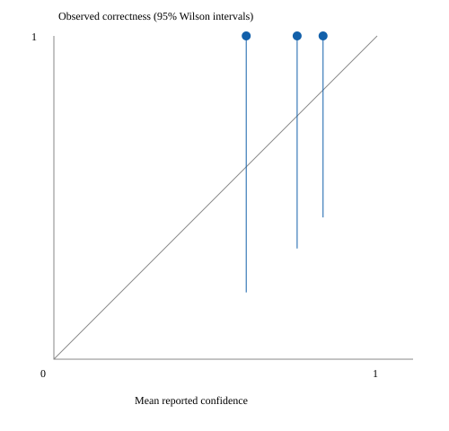

# ATT&CK benchmark

Corpus: reviewed-script-regression-v1 (synthetic-regression-not-independent-malware-benchmark)

| Technique | TP | FP | FN | Precision | Recall |
|---|---:|---:|---:|---:|---:|
| T1057 | 0 | 0 | 1 | N/A | 0.000 |
| T1059 | 3 | 0 | 0 | 1.000 | 1.000 |
| T1059.001 | 1 | 0 | 1 | 1.000 | 0.500 |
| T1059.004 | 0 | 0 | 1 | N/A | 0.000 |
| T1059.007 | 0 | 0 | 1 | N/A | 0.000 |
| T1105 | 1 | 0 | 0 | 1.000 | 1.000 |
| T1486 | 0 | 0 | 0 | N/A | N/A |
| T1505.003 | 1 | 0 | 0 | 1.000 | 1.000 |

Emitted: judged claims only. Decisions: all judged pairs, absent mappings scored 0 (not a Bayesian posterior). Neither implies deployment calibration.

